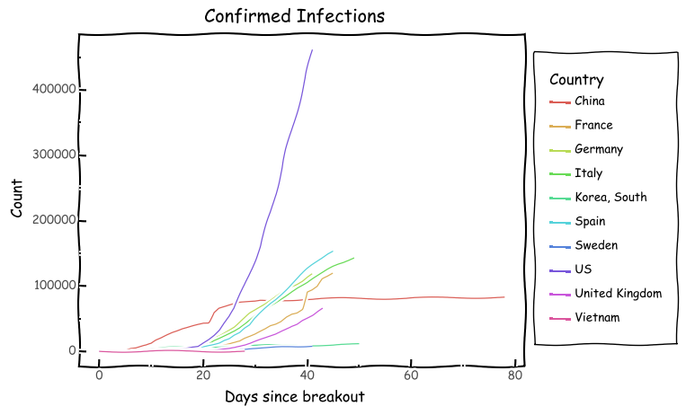
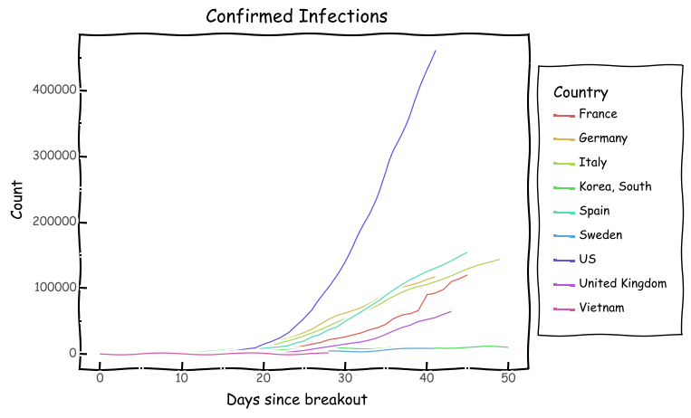
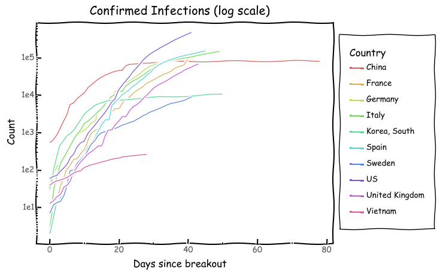

# COVID-19 Analysis
Analysis of corona virus infections and deaths based on data from https://github.com/CSSEGISandData/COVID-19 .

### Disclaimer

I am not an epidemiologist, virologist, or any other expert in the field. I work in data science and engineering. I'm not a Tory, nor am I Labour. In recent times, I'm politically vacant. There is no political motivation behind this analysis. Nor do I have anything to gain or promote. 

In terms of infection numbers, I've taken the number of confirmed cases. This is not ideal as the confirmed cases are far far lower than the expected actual infections. I discuss this more later.

There could be errors in the underlying data, in the analysis, or in the interpretation. If you do find any, I'd appreciate it if you let me know in a constructive manner - either here on github, or on twitter (@ashic). 

# Summary 

I have immense respect for the CMO, CSO, and the outstanding researchers working on the UK's approach to dealing with this pandemic. From my limited understanding, the work is exemplary, and the approach is credible. 

I will outline my approach and findings. I will then discuss various aspects of the situation, and in the end, have a section where I'll provide regular updates. The charts will be updated regularly (ideally, once a day, when the underlying data is refreshed).

# Approach

Different countries had their break outs at different times. This makes it incredibly difficult to compare them, as each scenario is different. Italy and the UK had their first confirmed cases on the same day - January 31, 2020. Since then, Italy has had far higher infection rates than the UK. However, it could be argued that the UK didn't really experience a breakout on January 31. I'm analysing confirmed infection rates and deaths separately. For confirmed infections, I'm taking the first day where the confirmed infections role by 5% day on day for the subsequent five days as the breakout date. This represents a sustained increase, but doesn't lose data from before a certain number of confirmed infections. For deaths, I'm taking the day of the first death to be the day from which we analyse the corresponding country's data. Death numbers are still quite low for most countries, and as such, this is - in my opinion - acceptable. I may change the criteria in the future.

# Findings

## Infection Numbers since Breakout

 

foo bar

This chart is difficult to read. It also suffers from the problem that our data source starts on January 22, 2020. On that date, China already had 548 confirmed cases. Even with this chart, we see that cases in Italy and Spain are rising rapidly. Italy crossed 500 cases 7 days into her breakout. As such, shifting China's curve 7 days to the right would give a more accurate depiction. Even with that, we see that Italy started off better, but now is following a very similar exponential path. Taking China out of the picture gives us a clearer view of the others.

 

Speaking of exponentials, a good approach to visualise comparison in exponential growth is on a logarithmic scale. For the unitiated, this means were comparing orders of magnitude, rather than absolute numbers. Something that grows exponentially on a normal scale may be linear of a logarithmic scale. 

